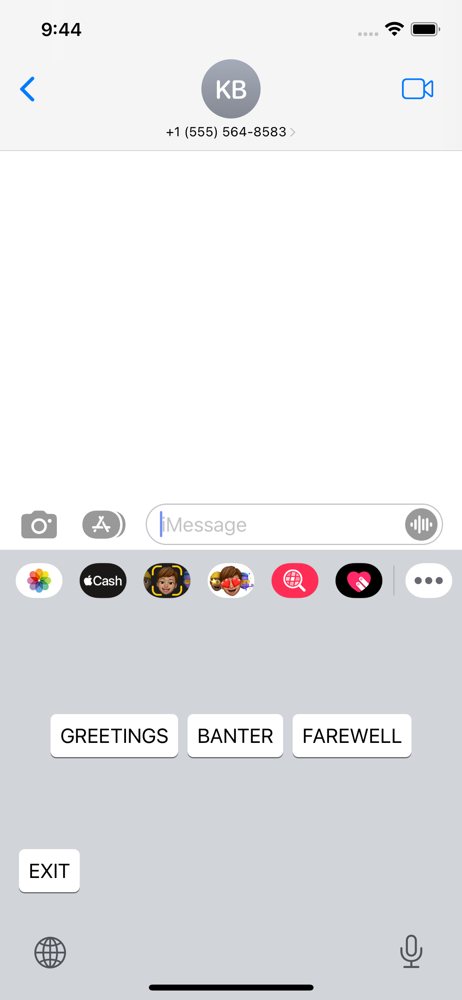

# Create an iOS Custom Keyboard extension
Given that the custom keyboard extension is the heart of our application, we'd like to see you create one of your own!

## Goal:
Complete the custom keyboard extension that's started in this repo. Use the provided endpoint (see "Requirements" below) to load content from an API and render it in the keyboard UI (see example image at the bottom of this page). 

## Requirements
* All of the UI work should be done in SwiftUI. I already setup the initial rendering of our root SwiftUI view in `RootView.swift`. You should be able to implement a typical SwifUI application from there.
  * Note `KeyboardViewController` acts as the lifecycle controller for the entire keyboard. Somewhat like the AppDelegate for the extension.
* You can send a `GET` request to `https://frontend-coding-challenge-api.herokuapp.com/getContent` to fetch the content.
  * Remember to display a loading state while the content is being fetched.
  * The API will randomly (about 1/5 times) return an error with status code `500` and json data `{ error: 'Random Error' }`. Make sure you handle this.
* Tapping each button should cycle through all of the `content` attached to the button (inspect the data coming back from the api to figure out the extra content).
* Match Apple's keyboard styling as best you can.
* Make sure to include a button to exit your custom keyboard and take the user back to the default keyboard

## Additional (please implement at least 1)
* Long-press delete functionality that mimics Apple's
* Long-press on a button show's a popup list with all of the content options.
  * Selecting one should output it to the text input
* Use some sort of frontend caching/storage to avoid showing a loading state every time the user toggles in and out of the keyboard.
* Other fun or useful UI improvements. This is up to you! Some examples:
  * A moving progress bar on each button that shows how far the user has progressed in the content
  * Animate the text moving from the button up to the text input
  * Transitions between different states (loading, error, rendering the content)
  * Dark mode

## Instructions for running the keyboard on device or simulator
1. Open **keysCustomKeyboardChallenge.xcodeproj** in Xcode
2. Select target **keyboard** from the target dropdown list and a simulator or your own device to run it on.  
<image src="./challengeAssets/keyboard-target-selection.png">

3. You will see a popup with options for a "host" application where you can run the keyboard extension. You can choose any application to run the keyboard, but **messages** is probably the most relevant  
<image src="./challengeAssets/app-popup.png" width="200" />

4. You will need to turn on the keyboard in **Settings**. In the simulator/device navigate to **Settings** -> **General** -> **Keyboard** -> **Keyboards** -> **Add New Keyboard** -> **keysCustomKeyboardChallenge**. Then navigate back to **Messages** and you should be able to switch to the keyboard using the globe button. [See demo video here](https://frontend-coding-challenge-api.herokuapp.com/)

## Resources
* [Apple's iOS Custom keyboard getting started guide (the initial setup is already completed)](https://developer.apple.com/documentation/uikit/keyboards_and_input/creating_a_custom_keyboard)
* [How to output text from an iOS Custom Keyboard](https://developer.apple.com/documentation/uikit/uitextdocumentproxy)

## Example layout:

